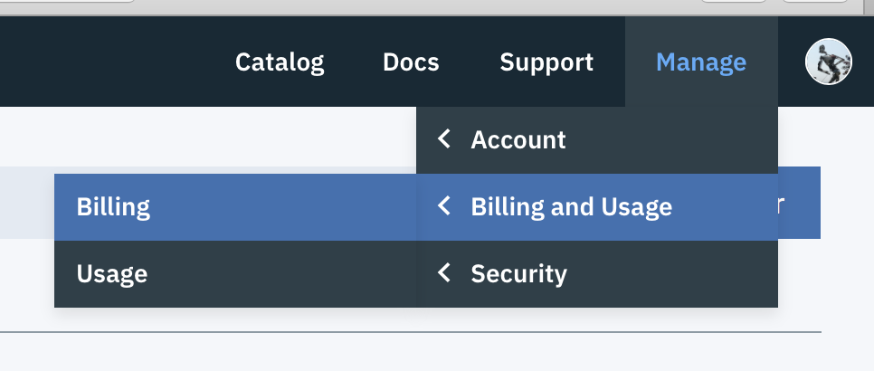
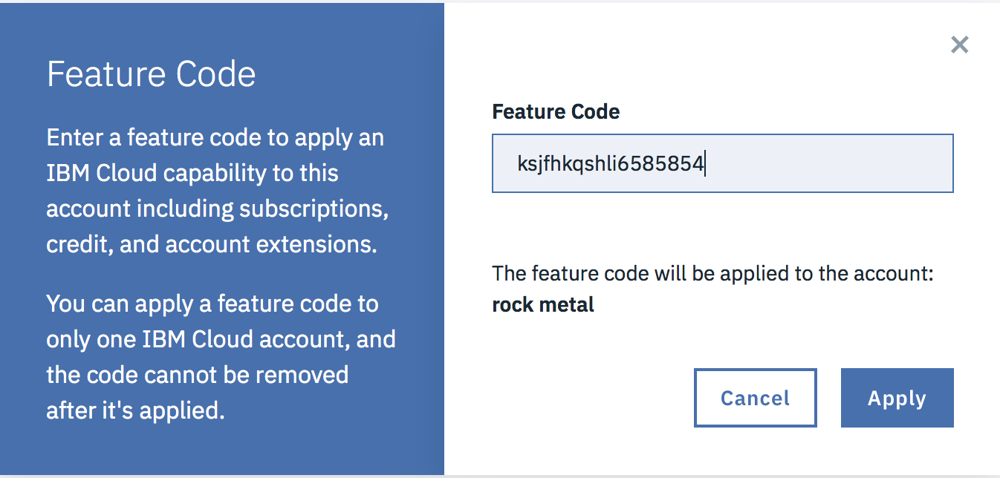

<div style="background-color:black;color:white; vertical-align: middle; text-align:center;font-size:250%; padding:10px; margin-top:100px"><b>
Practical Container Orchestration Workshop - Prerequisites 
 </b></a></div>

---
# Preparing the lab
---


+++

# Table of Content

[[toc]]


+++

Before you can run all the labs about container orchestration, you should prepare your environment to execute those labs.


# Task 1. IBM Cloud registration

Labs are running on the **IBM Cloud** (ex Bluemix).

So before you can start any labs, you should have satisfied the following prerequisites :
- [ ] You should have **1 valid email** 
- [ ] Sign up to the **IBM Cloud** (ex Bluemix)

Here are some helpful steps :

### Sign in to IBM Cloud
If you don't have already registered to **IBM Cloud**,  
Open this link  [IBM Cloud](http://bluemix.net) or type http://bluemix.net in your favorite internet browser.


### Fill in the form
Specify last name, first name, corp, country, phone number and password.
> By **default**, all new people that register to IBM Cloud will have an **Lite Account** with **no time restriction**. This is not a 30 day trial account. 

Click on **Create Account** button. 


### Confirm your registration to IBM Cloud from your inbox
From your email application, confirm the account creation.


Log in to IBM Cloud with your credentials :


# Task 2. Apply a promo code (if necessary)

Check if you can access to **Containers in Kubernetes Clusters**.
To do so, click on **Catalog** and click on **Containers** on the left pane on the page :

 


> **IMPORTANT** : If you just see **Container Registry** and not the Containers in Kubernetes Clusters, then **you will need a promo code !!!**

> **IMPORTANT** : If you don't have a **promo code**, then ask IBM during the workshop. You can continue the other steps of this preparation and come back later to this step. However, to create a cluster, you will need a promo code.

To install a promo code, follow the procedure : 

Go to **Manage > Billing and Usage > Billing** and press enter.




You should get the following section in the billing page  :


Click **Apply Code** button.




Enter your **promo code** and click **Apply** 


> Close this window and **logout / login** to your account.

Go back to the **Catalog** and check that now you have access to **Containers in Kubernetes Clusters** and the Container Registry.


# Task 3. Install Docker CE on your Mac

Follow this procedure to install the latest Docker Community Edition on your Mac (**for Windows**, jump to the next session) 

Docker CE for Mac is free to download.

https://store.docker.com/editions/community/docker-ce-desktop-mac


Install it (click on the blue button **Get Docker**)

Double-click **Docker.dmg** to start the install process.

When the installation completes and Docker starts, the whale in the top status bar shows that Docker is running, and accessible from a terminal.


Open a terminal and type :

`docker version`

You should see something similar to this screen :
```console
phil:[node]: docker version
Client:
 Version:      18.03.1-ce
 API version:  1.37
 Go version:   go1.9.5
 Git commit:   9ee9f40
 Built:        Thu Apr 26 07:13:02 2018
 OS/Arch:      darwin/amd64
 Experimental: false
 Orchestrator: swarm

Server:
 Engine:
  Version:      18.03.1-ce
  API version:  1.37 (minimum version 1.12)
  Go version:   go1.9.5
  Git commit:   9ee9f40
  Built:        Thu Apr 26 07:22:38 2018
  OS/Arch:      linux/amd64
  Experimental: true

```
> Note that you should always have the client and the server running.

> The Docker server contains the **Docker engine**(containerd) that controls running containers. 


# Task 4. Install Docker CE on Windows

Follow this procedure to install the latest Docker Community Edition on Windows (for Mac, jump to the previous session) 

Docker CE for Windows is free to download.

https://store.docker.com/editions/community/docker-ce-desktop-windows


Leave the default parameters: 


After download, install Docker CE

**Double-click Docker for Windows Installer** to run the installer.

> **IMPORTANT**: During the installation process, you may be informed the installer will reboot your workstation to install the virtualization feature of your PC. 


When the installation finishes, Docker starts automatically. The **whale** in the notification area indicates that Docker is running, and accessible from a terminal.

Open a command-line terminal like PowerShell, and try out some Docker commands!

Run docker version to check the version.

`docker version`

You should see something similar to this screen :
```console
phil:[node]: docker version
Client:
 Version:      18.03.1-ce
 API version:  1.37
 Go version:   go1.9.5
 Git commit:   9ee9f40
 Built:        Thu Apr 26 07:13:02 2018
 OS/Arch:      Windows/amd64
 Experimental: false
 Orchestrator: swarm

Server:
 Engine:
  Version:      18.03.1-ce
  API version:  1.37 (minimum version 1.12)
  Go version:   go1.9.5
  Git commit:   9ee9f40
  Built:        Thu Apr 26 07:22:38 2018
  OS/Arch:      Windows/amd64
  Experimental: true

```
> Note that you should always have the client and the server running.

> The Docker server contains the **Docker engine**(containerd) that controls running containers. 

# Task 5. Install Git on your laptop

To do so : 

For MacOS :
http://mac.github.com

For Windows: 
http://git-scm.com/download/win

At some point during the installation, change to the **"Use Windows default console"** and continue the installation.


# Task 6. Install the bx command

The IBM Cloud command line interface (CLI) provides a set of commands that are grouped by namespace for users to interact with IBM Cloud.

For MacOS :
https://clis.ng.bluemix.net/download/bluemix-cli/latest/osx

For Windows: 
https://clis.ng.bluemix.net/download/bluemix-cli/latest/win64

Then add some plugins. To do so, first add a repo of plugins :

`bx plugin repo-plugins -r Bluemix`

Then add the container-registry plugin :

`bx plugin install container-registry -r Bluemix`

```console
bx plugin install container-registry -r Bluemix
Looking up 'container-registry' from repository 'Bluemix'...
Plug-in 'container-registry 0.1.316' found in repository 'Bluemix'
Attempting to download the binary file...
 29.06 MiB / 29.06 MiB [============================================================================================================] 100.00% 2m22s
30468064 bytes downloaded
Installing binary...
OK
Plug-in 'container-registry 0.1.316' was successfully installed into /Users/phil/.bluemix/plugins/container-registry. Use 'bx plugin show container-registry' to show its details.
```

And the container-service plugin : 

`bx plugin install container-service -r Bluemix`

```console
bx plugin install container-service -r Bluemix
Looking up 'container-service' from repository 'Bluemix'...
Plug-in 'container-service 0.1.316' found in repository 'Bluemix'
Attempting to download the binary file...
 29.06 MiB / 29.06 MiB [============================================================================================================] 100.00% 2m22s
30468064 bytes downloaded
Installing binary...
OK
Plug-in 'container-service 0.1.316' was successfully installed into /Users/phil/.bluemix/plugins/container-service. Use 'bx plugin show container-service' to show its details.
```

Finally, list all plugin installed :

`bx plugin list`

```console
bx plugin list
Listing installed plug-ins...

Plugin Name          Version   
container-registry   0.1.316   
container-service    0.1.488   
```

# Task 7. Login to IBM Cloud

 Login to IBM Cloud with the bx command :
 
 `bx login -a api.eu-gb.bluemix.net`
 
 And answer a few questions: email, password, account, 
 
 ```console 
 bx login -a api.eu-gb.bluemix.net
API endpoint: api.eu-gb.bluemix.net

Email> philmetal@mail.com

Password> 
Authenticating...
OK

Targeted account rock metal (4d327e6ba61d02089dab9af842d267c9)
Targeted resource group Default
                     
API endpoint:     https://api.eu-gb.bluemix.net (API version: 2.92.0)   
Region:           eu-gb   
User:             philmetal@mail.com   
Account:          rock metal (4d327e6ba61d02089dab9af842d267c9)   
Resource group:   Default   
Org:                 
Space:               

Tip: If you are managing Cloud Foundry applications and services
- Use 'bx target --cf' to target Cloud Foundry org/space interactively, or use 'bx target -o ORG -s SPACE' to target the org/space.
- Use 'bx cf' if you want to run the Cloud Foundry CLI with current IBM Cloud CLI context.

````

And optionally, you can also specify the following ORG and SPACE with that command :

`bx target -o philmetal@mail.com -s dev`

> replace the organisation (-o) with your email (the default).

```console
bx target -o philmetal@mail.com -s dev
Targeted org philmetal@mail.com

Targeted space dev


                     
API endpoint:     https://api.eu-gb.bluemix.net (API version: 2.92.0)   
Region:           eu-gb   
User:             philmetal@mail.com   
Account:          rock metal (4d327e6ba61d02089dab9af842d267c9)   
Resource group:   Default   
Org:              philmetal@mail.com   
Space:            dev   

```


# Task 8. Conclusion

###  Results
<span style="background-color:yellow;">Successful exercise ! </span>
You finally went thru the following features :
- [x] You registered to IBM Cloud
- [x] You applied a promo code
- [x] You installed Docker on your laptop
- [x] You installed Git
- [x] You installed the bx command
- [x] You login to IBM Cloud successfully
- [x] You are ready for the labs
---
# End of Prerequisites
---

<div style="background-color:black;color:white; vertical-align: middle; text-align:center;font-size:250%; padding:10px; margin-top:100px"><b>
Practical Container Orchestration Workshop - Prerequisites 
</b></a></div>
