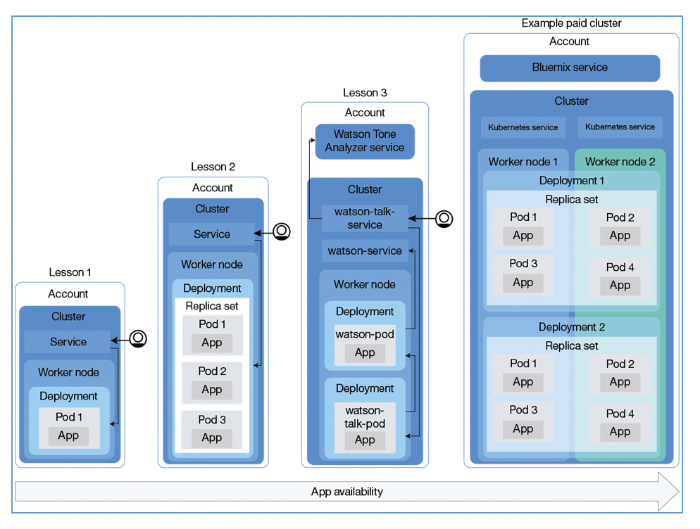
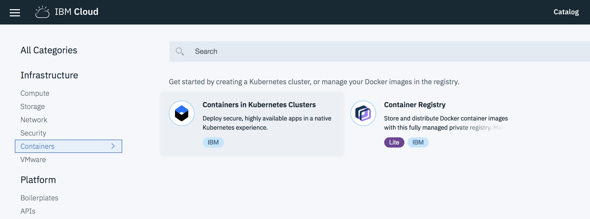
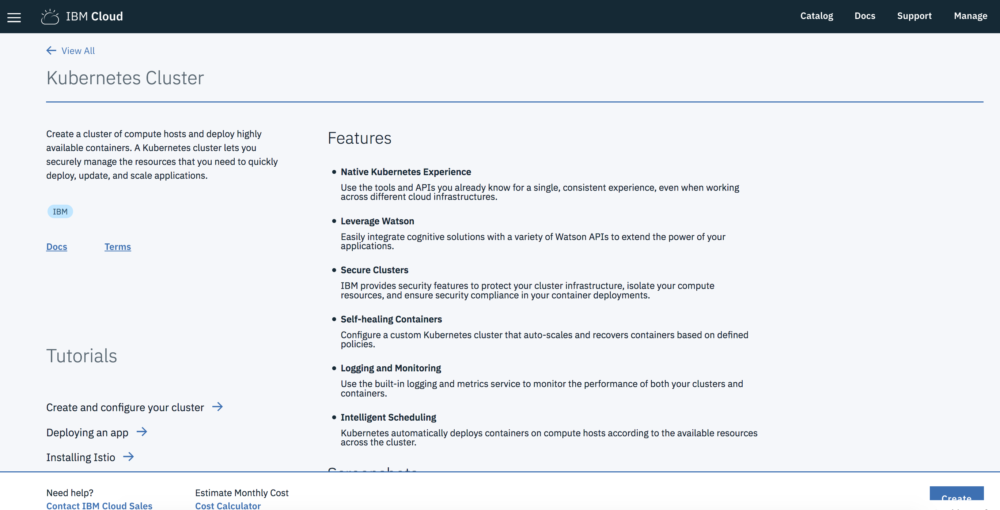
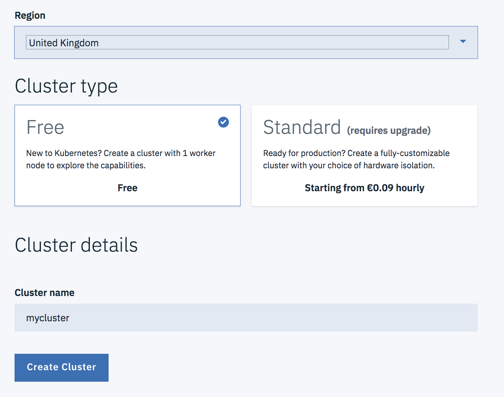
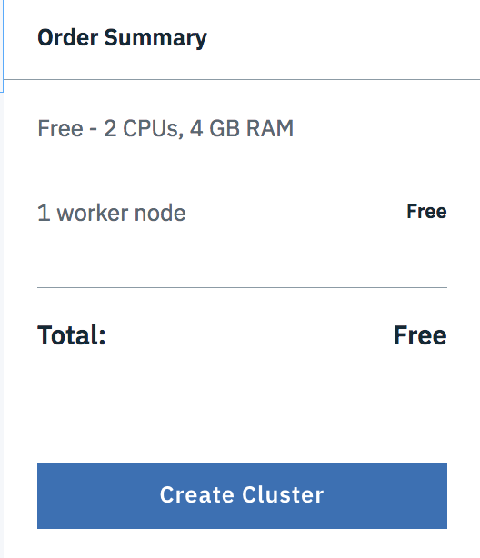

<div style="background-color:black;color:white; vertical-align: middle; text-align:center;font-size:250%; padding:10px; margin-top:100px"><b>
Practical Container Orchestration

Kubernetes Lab
 </b></a></div>


---

Table of Contents

---

[[toc]]

---
# Introduction to IBM Cloud Kubernetes Service

IBM Cloud Kubernetes Service combines Docker and Kubernetes to deliver powerful tools, an intuitive user experience, and built-in security and isolation to automate the deployment, operation, scaling, and monitoring of containerized apps over a cluster of independent compute hosts by using the Kubernetes APIs.

## Docker containers

Docker is an open source project that was released by dotCloud in 2013. Built on features of the existing Linux container technology (LXC), Docker became a software platform that you can use to build, test, deploy, and scale apps quickly. Docker packages software into standardized units that are called containers that include all of the elements that an app needs to run.

Review these concepts to learn about basic Docker concepts.

**Container**

A container is a standard way to package an app and all its dependencies so that the app can be moved between environments and run without changes. Unlike virtual machines, containers do not virtualize a device, its operating system, and the underlying hardware. Only the app code, run time, system tools, libraries, and settings are packaged inside the container. Containers run as isolated processes on the compute host where they are deployed to and share the host operating system and its hardware resources. This approach makes a container more lightweight, portable, and efficient than a virtual machine.

**Image**

Every container is based on a Docker image and is considered to be an instance of an image. An image is built from a Dockerfile, which is a file that contains instructions how to build the image, and any build artifacts, such as an app, the app's configuration, and its dependencies.

**Registry**

An image registry is a place where you store, retrieve, and share Docker images. Images that are stored in a registry can either be publicly available (public registry) or accessible by a small group of users only (private registry). IBM Cloud Kubernetes Service offers public images, such as ibmliberty that you can use to get started with Docker and Kubernetes to create your first containerized app in a cluster. When it comes to enterprise applications, use a private registry like the one provided in IBM Cloud to protect your images from being used and changed by unauthorized users. 

When you want to deploy a container from an image, you must make sure that the image is stored in either a public or private image registry.

## Kubernetes

Kubernetes was developed by Google as part of the Borg project and handed off to the open source community in 2014. Kubernetes combines more than 15 years of Google research in running a containerized infrastructure with production work loads, open source contributions, and Docker container management tools to provide an isolated and secure app platform that is portable, extensible, and self-healing in case of failovers.

Learn about the basics of how Kubernetes works with a little terminology.


**Cluster**

A Kubernetes cluster consists of one or more virtual machines that are called worker nodes. Every worker node represents a compute host where you can deploy, run, and manage containerized apps. Worker nodes are managed by a Kubernetes master that centrally controls and monitors all Kubernetes resources in the cluster. When you deploy a containerized app, the Kubernetes master decides where to deploy the app, taking into account the deployment requirements and available capacity in the cluster.

**Pod**

Every containerized app that is deployed into a Kubernetes cluster is deployed, run, and managed by a pod. Pods represent the smallest deployable units in a Kubernetes cluster and are used to group containers that must be treated as a single unit. In most cases, a container is deployed to its own pod. However, an app might require a container and other helper containers to be deployed into one pod so that those containers can be addressed by using the same private IP address.

**Deployment**

A deployment is a Kubernetes resource where you specify your containers and other Kubernetes resources that are required to run your app, such as persistent storage, services, or annotations. Deployments are documented in a Kubernetes deployment script. When you run a deployment, the Kubernetes master deploys the specified containers into pods taking into account the capacity that is available on the worker nodes of the cluster. Other Kubernetes resources are created and configured as specified in the deployment script. 

You can use a deployment to define update strategies for your app, which includes the number of pods that you want to add during a rolling update and the number of pods that can be unavailable at a time. When you perform a rolling update, the deployment checks whether the revision is working and stops the rollout when failures are detected.

**Service**

A Kubernetes service groups a set of pods and provides network connection to these pods for other services in the cluster without exposing the actual private IP address of each pod. You can use a service to make your app available within your cluster or to the public internet. 




With IBM Cloud Kubernetes Service, you can define complex architectures that implement resiliency, high availability and replication between data centers and regions (also called AZ – availability zones). See some examples below. In this lab, we are not going to implement such a complex environment. 

# Task 1 : Create your first cluster

Kubernetes is an orchestration tool for scheduling app containers onto a cluster of compute machines. With Kubernetes, developers can rapidly develop highly available applications by using the power and flexibility of containers.

Before you can deploy an app by using Kubernetes, start by **creating a cluster**. A cluster is a set of worker nodes that are organized into a network. The purpose of the cluster is to define a set of resources, nodes, networks, and storage devices that keep applications highly available.

To create a lite cluster:

## 1.  Select the IBM Kubernetes Service	

From the Catalog, in the Containers category, click Containers in Kubernetes Cluster.



## 2. Create the service

To use that service, click the blue button(create) at the bottom:




## 3.	Choose a region and a free Cluster

Select the **United Kingdom** region on the top and select Free.



Keep **mycluster** as the name of your cluster

The default cluster type is **free**. Next time, you can create a standard cluster and define additional customizations, like how many worker nodes are in the cluster.





## 4.	Click Create Cluster. 


The details for the cluster open, but the worker node in the cluster takes a few minutes (around 10 minutes) to provision. You can see the status of the worker node in the Worker nodes tab. When the status reaches Ready, your worker node is ready to be used.


## 5.	Don’t wait the creation of your cluster. 

You can jump into the next chapter to set up your cluster environment. 

The lite cluster has one worker node with 2 CPU and 4 GB memory available for your apps to use for one month.

The worker node is centrally monitored and managed by a dedicated and highly available **IBM-owned Kubernetes master** that controls and monitors all of the Kubernetes resources in the cluster. You can focus on your worker node and the apps that are deployed in the worker node without worrying about managing this master too.

The resources that are required to run the cluster, such as **VLANS and IP addresses**, are managed in an **IBM-owned IBM Cloud** Infrastructure (SoftLayer) account. When you create a standard cluster, you manage these resources in your own IBM Cloud Infrastructure (SoftLayer) account. You can learn more about these resources when you create a standard cluster.

**Tip**: Lite clusters that are created with a IBM Cloud free trial account are automatically removed after the free trial period ends, unless you upgrade to a IBM Cloud Pay-As-You-Go account.

# Task 2 : prepare your environment

Deploy and manage your own Kubernetes cluster in the cloud. You can automate the deployment, operation, scaling, and monitoring of containerized apps in a cluster of independent compute hosts called worker nodes.

**To set up the infrastructure:**
•	Install all the CLIs for using the Kubernetes API and managing Docker images
•	Create a private image repository in IBM Cloud Container Registry to store your images

It can take a few minutes to provision your cluster. To make the most of your time, create your cluster before installing all the CLIs. 

On your laptop, you have to prepare your environment to be ready to use Kubernetes and your cluster **mycluster**.

### 1. Check that docker is running on your laptop

`docker version`

If you get an error, go to the PrepareLab.MD file to understand how to install docker on your laptop.

### 2. Check that bx cs and bx cr have been installed

`ic plugin list`

```console
ic plugin list
Listing installed plug-ins...

Plugin Name          Version   
container-registry   0.1.316   
container-service    0.1.488   
```

### 3. NEW ! Install kubectl on your laptop

**kubectl** is the command that controls Kubernetes objects and resources. This is just one exec file that you must put in the right library on your computer. 

For complete functional compatibility, download the Kubernetes CLI version that matches the Kubernetes cluster version you plan to use. The current IBM Cloud Kubernetes Service default Kubernetes version is 1.9.7

Download the kubectl file for your laptop:

OS X: https://storage.googleapis.com/kubernetes-release/release/v1.9.8/bin/darwin/amd64/kubectl  

Linux: https://storage.googleapis.com/kubernetes-release/release/v1.9.8/bin/linux/amd64/kubectl
  
Windows: https://storage.googleapis.com/kubernetes-release/release/v1.9.8/bin/windows/amd64/kubectl.exe  

**OS X or Linux**, complete the following steps.

Move the executable file to the **/usr/local/bin** directory.

```console
cd <path_where_is_kubectl>
mv ./kubectl /usr/local/bin/kubectl
```

Be sure that /usr/local/bin is listed in your PATH system variable. The PATH variable contains all directories where your operating system can find executable files. The directories that are listed in the PATH variable serve different purposes. /usr/local/bin is used to store executable files for software that is not part of the operating system and that was manually installed by the system administrator.

`echo $PATH`

Your output looks similar to the following.

`/usr/local/bin:/usr/bin:/bin:/usr/sbin:/sbin`

Make the file executable.

`chmod +x /usr/local/bin/kubectl`

**Windows**, complete the following steps.

Move the executable file **kubectl.exe** to a directory that is available in your path like `"C:\Program Files\IBM\Bluemix\bin"`or `"C:\Program Files"`


### 4. Check kubectl

type the following command :

`kubectl version short`

And you should get version 1.9.8 :

```console 
$ kubectl version --short
Client Version: v1.9.8
error: You must be logged in to the server (the server has asked for the client to provide credentials)
````
The error at the end is normal because we need to specify how to connect to the master. 

### 5. Gain access to the cluster

Log into your IBM Cloud account if no already logged in.

`ic login -a https://api.eu-gb.bluemix.net`

> don't forget to `ic target -o ORG -s SPACE` where ORG is your email and SPACE is dev.

Then go to your Cluster Region :

`ic cs region-set uk-south`


Set the context for the cluster in your CLI.

`ic cs cluster-config mycluster`

Here is the output:

```console
$ ic cs cluster-config mycluster
OK
The configuration for mycluster was downloaded successfully. Export environment variables to start using Kubernetes.

export KUBECONFIG=/Users/phil/.bluemix/plugins/container-service/clusters/mycluster/kube-config-mil01-mycluster.yml
```

 > IMPORTANT : Set the KUBECONFIG environment variable. **Copy the output from the previous command and paste it in your terminal**. The command output should look similar to the following.
 
 `export KUBECONFIG=/Users/phil/.bluemix/plugins/container-service/clusters/mycluster/kube-config-mil01-mycluster.yml`
 
 Verify that you can connect to your cluster by listing your worker nodes.
 
 `kubectl get nodes`
 
 The output should be :
 
 ```console 
$ kubectl get nodes
NAME            STATUS    ROLES     AGE       VERSION
10.144.186.74   Ready     <none>    11m       v1.9.8-2+af27ab4b096122
````
**YOU ARE NOW CONNECTED TO YOUR CLUSTER**

# Task 3 : Creating a private registry


Set up your own private image repository in IBM Cloud Container Registry to securely store and share Docker images with all cluster users. A private image repository in IBM Cloud is identified by a **namespace**. The namespace is used to create a unique URL to your image repository that developers can use to access private Docker images.


We choose a unique name as our namespace to group all images in our account. Replace <your_namespace> with a namespace of your choice and not something that is related to the tutorial.

`ic cr namespace-add <my_namespace>`

```console
$ ic cr namespace-add imgreg        
Adding namespace 'imgreg'...
Successfully added namespace 'imgreg'
OK
````

Now login to the IBM Cloud registry:

`ic cr login`

Output:
```console 
$ ic cr login
Logging in to 'registry.eu-gb.bluemix.net'...
Logged in to 'registry.eu-gb.bluemix.net'.

OK
```

To test our new private registry, do the following steps:

1. get the hello-world image from Docker-Hub

`docker pull hello-world`

2. tag the hello-world image with a name containing your private registry name :

`docker tag hello-world registry.eu-gb.bluemix.net/<my_namespace>/hello-world:latest`

3. push your image in the private registry

`docker push registry.eu-gb.bluemix.net/<my_namespace>/hello-world:latest`

4. List the images in the private registry

`ic cr image-list`


1. check the kubernetes version again: 

`kubectl version --short`

Output is:

```console
$ kubectl version --short
Client Version: v1.9.8
Server Version: v1.9.8-2+af27ab4b096122
```
As you can see, it is another way to see that we are connected to the server.


# Task 4 : Deploying Apps with Kubernetes


### 1. Check connection to your cluster 

Also test your connectivity to the cluster with this command:

 `kubectl get nodes`

If you get an error message like "error: You must be logged in to the server (Unauthorized)", then you must setup your KUBECONFIG (see a previous topic)
    

### 2. Download a GIT repo for this exercise

**Create a directory** on your computer and move to that directory.

Get and download this github repository into that directory :

`git clone https://github.com/IBM/container-service-getting-started-wt.git`
	


### 3. Build a Docker image 

Build the image locally and tag it with the name that you want to use on the  kubernetes cluster. The tag includes the namespace name of `<namespace>` in the cluster. The tag also targets the master node of the cluster, which manages the job of placing it on one or more worker nodes. This is because of the alias you created in the previous step, with the cluster name linked to the master node name. Tagging the image this way tells Docker where to push the image in a later step. Use **lowercase alphanumeric** characters or underscores only in the image name. Don't forget the period (.) at the end of the command. The period tells Docker to look inside the current directory for the Dockerfile and build artifacts to build the image.

`cd "container-service-getting-started-wt/Lab 1"`

`docker build -t registry.eu-gb.bluemix.net/<namespace>/hello1 .`

Output is:

```console
$ docker build -t registry.eu-gb.bluemix.net/imgreg/hello1 .
Sending build context to Docker daemon  15.36kB
Step 1/6 : FROM node:9.4.0-alpine
 ---> b5f94997f35f
Step 2/6 : COPY app.js .
 ---> Using cache
 ---> 1656019fb44c
Step 3/6 : COPY package.json .
 ---> Using cache
 ---> 25073c1f4ffc
Step 4/6 : RUN npm install &&    apk update &&    apk upgrade
 ---> Using cache
 ---> 9d9be9bd3e04
Step 5/6 : EXPOSE  8080
 ---> Using cache
 ---> 0d2c2bddc163
Step 6/6 : CMD node app.js
 ---> Using cache
 ---> 51c706fdc0c1
Successfully built 51c706fdc0c1
Successfully tagged registry.eu-gb.bluemix.net/imgreg/hello1:latest
```

To see the image, use the following command:

`docker images registry.eu-gb.bluemix.net/<namespace>/hello1:latest`

Example:
 
 ```console
$ docker images registry.eu-gb.bluemix.net/imgreg/hello1:latest
REPOSITORY                                 TAG                 IMAGE ID            CREATED             SIZE
registry.eu-gb.bluemix.net/imgreg/hello1   latest              51c706fdc0c1        2 months ago        74.1MB
 ```

### 4. push the image to the registry. 

Push your image into the private registry :

    
`docker push registry.eu-gb.bluemix.net/<namespace>/hello1:latest`
 
 Your output should look like this.

```console
$ docker push registry.eu-gb.bluemix.net/imgreg/hello1
The push refers to repository [registry.eu-gb.bluemix.net/imgreg/hello1]
57eebb8b0417: Pushed 
05e20323e508: Layer already exists 
d200459bdbd0: Layer already exists 
0804854a4553: Layer already exists 
6bd4a62f5178: Pushed 
9dfa40a0da3b: Layer already exists 
latest: digest: sha256:4d754d9b243818185bb18a5b25f41bf1a2eb3ea7ad3efcdafbe1b204664b56f7 size: 1576
```

> **IMPORTANT** : be sure that all the layers have been pushed, wait for the digest line.


### 5. Open the Kubernetes Console

Go to your IBM Cloud Console and click on the IBM Cloud icon on the top left part of the screen:


Then select **"mycluster"** to see the Kubernetes Cluster details.


> Now go to the Worker Nodes section (on the left pane) and **take a note** of the **public IP of that worker node** :


On the right part of the screen, **click the blue button** : Kubernetes Dashboard


You can look around in the dashboard to see all the different resources (pods, nodes ...) or  the workloads (deployments, services ...).


### 6. Run a deployment

Use your image to create a kubernetes deployment with the following command.

`kubectl run hello1-deployment --image=registry.eu-gb.bluemix.net/<namespace>/hello1`
  
Output is :

```console
$ kubectl run hello1-deployment --image=registry.eu-gb.bluemix.net/imgreg/hello1
deployment "hello1-deployment" created
```
You can also look at the dashboard to see the deployment:


### 7. Create a service 

Create a service to access your running container using the following command.

`kubectl expose deployment/hello1-deployment --type=NodePort --port=8080 --name=hello1-service --target-port=8080`
 
  
Your output should be:

```console
$ kubectl expose deployment/hello1-deployment --type=NodePort --port=8080 --name=hello1-service --target-port=8080
service "hello1-service" exposed
```

And you can also go to the dashboard :


### 8. NodePort type

With the NodePort type of service, the kubernetes cluster creates a 5-digit port number to access the running container through the service. 

The service is accessed through the IP address of the proxy node with the NodePort port number. To discover the NodePort number that has been assigned, use the following command.

`kubectl describe service hello1-service`

 Your output should look like this.

```console
$ kubectl describe service hello1-service
Name:                     hello1-service
Namespace:                default
Labels:                   run=hello1-deployment
Annotations:              <none>
Selector:                 run=hello1-deployment
Type:                     NodePort
IP:                       172.21.219.48
Port:                     <unset>  8080/TCP
TargetPort:               8080/TCP
NodePort:                 <unset>  32509/TCP
Endpoints:                172.30.192.135:8080
Session Affinity:         None
External Traffic Policy:  Cluster
Events:                   <none>
```

Or look at the dashboard:


 
 


### 9. The NodePort number is `32509`. 

Yours may be different. Open a Firefox browser window or tab and go to the URL of your node with your NodePort number, such as `http://159.122.181.117:32509`. Your output should look like this.


 

### 10. Describe subcommand

You can view much of the information on your cluster resources visually through the Kubernetes console.  As an alternative, you can obtain text-based information on all the resources running in your cluster using the following command.

`kubectl describe all`
 
Congratulations ! You have deployed your first app to the IBM Cloud kubernetes cluster.


# Task 5 : Scaling Apps with Kubernetes

In this lab, understand how to update the number of replicas a deployment has and how to safely roll out an update on Kubernetes. Learn, also, how to perform a simple health check.

For this lab, you need a running deployment with a single replica. First, we cleaned up the running deployment.

### 1. Clean up the current deployment

To do so, use the following commands :
- To remove the deployment, use:
 
`kubectl delete deployment hello1-deployment`

- To remove the service, use: 

`kubectl delete service hello1-service`

### 2. Run a clean deployment

To do so, use the following commands :

`kubectl run hello1-deployment --image=registry.eu-gb.bluemix.net/<namespace>/hello1`

### 3. Scale the application

A replica is how Kubernetes accomplishes scaling out a deployment. A replica is a copy of a pod that already contains a running service. By having multiple replicas of a pod, you can ensure your deployment has the available resources to handle increasing load on your application.

kubectl provides a scale subcommand to change the size of an existing deployment. Let's us it to go from our single running instance to 10 instances.

`kubectl scale --replicas=10 deployment hello1-deployment`

Here is the result:
```console
$ kubectl scale --replicas=10 deployment hello1-deployment
deployment "hello1-deployment" scaled
```

Kubernetes will now act according to the desired state model to try and make true, the condition of 10 replicas. It will do this by starting new pods with the same configuration.

To see your changes being rolled out, you can run: 

`kubectl rollout status deployment/hello1-deployment`

The rollout might occur so quickly that the following messages might not display:
```
$ kubectl rollout status deployment/hello1-deployment
Waiting for rollout to finish: 1 of 10 updated replicas are available...
Waiting for rollout to finish: 2 of 10 updated replicas are available...
Waiting for rollout to finish: 3 of 10 updated replicas are available...
Waiting for rollout to finish: 4 of 10 updated replicas are available...
Waiting for rollout to finish: 5 of 10 updated replicas are available...
Waiting for rollout to finish: 6 of 10 updated replicas are available...
Waiting for rollout to finish: 7 of 10 updated replicas are available...
Waiting for rollout to finish: 8 of 10 updated replicas are available...
Waiting for rollout to finish: 9 of 10 updated replicas are available...
deployment "hello1-deployment" successfully rolled out
````

Once the rollout has finished, ensure your pods are running by using: 

`kubectl get pods`

You should see output listing 10 replicas of your deployment:


Results :
```
$ kubectl get pods
NAME                                 READY     STATUS    RESTARTS   AGE
hello1-deployment-864cd87c7f-675sr   1/1       Running   0          5m
hello1-deployment-864cd87c7f-6wxkp   1/1       Running   0          3m
hello1-deployment-864cd87c7f-8fb7b   1/1       Running   0          3m
hello1-deployment-864cd87c7f-fn5t8   1/1       Running   0          3m
hello1-deployment-864cd87c7f-ksvgm   1/1       Running   0          3m
hello1-deployment-864cd87c7f-l2x97   1/1       Running   0          3m
hello1-deployment-864cd87c7f-mb5fw   1/1       Running   0          3m
hello1-deployment-864cd87c7f-nwzr5   1/1       Running   0          3m
hello1-deployment-864cd87c7f-vfnbl   1/1       Running   0          3m
hello1-deployment-864cd87c7f-w7p6m   1/1       Running   0          3m

```

### 4. Rollout an update to  the application

Kubernetes allows you to use a rollout to update an app deployment with a new Docker image. This allows you to easily update the running image and also allows you to easily undo a rollout, if a problem is discovered after deployment.

In the previous lab, we created an image with a 1 tag. Let's make a version of the image that includes new content and use a 2 tag. This lab also contains a Dockerfile. Let's build and push it up to our image registry.

If you are in "Lab 1" directory, you need to go to "Lab 2" directory:

`cd "container-service-getting-started-wt/Lab 2"`


Build a new version (2) of that application: 

`docker build -t registry.eu-gb.bluemix.net/<namespace>/hello1:2 .`

Then push the new version into the registry:

`docker push registry.eu-gb.bluemix.net/<namespace>/hello1:2`

Using kubectl, you can now update your deployment to use the latest image. kubectl allows you to change details about existing resources with the set subcommand. We can use it to change the image being used.

`kubectl set image deployment/hello1-deployment hello1-deployment=registry.eu-gb.bluemix.net/<namespace>/hello1:2`

Note that a pod could have multiple containers, in which case each container will have its own name. Multiple containers can be updated at the same time. 

Run kubectl rollout status deployment/hello-world or kubectl get replicasets to check the status of the rollout. The rollout might occur so quickly that the following messages might not display:

`kubectl rollout status deployment/hello1-deployment`

```
$ kubectl rollout status deployment/hello1-deployment
Waiting for rollout to finish: 2 out of 10 new replicas have been updated...
Waiting for rollout to finish: 3 out of 10 new replicas have been updated...
Waiting for rollout to finish: 3 out of 10 new replicas have been updated...
Waiting for rollout to finish: 3 out of 10 new replicas have been updated...
Waiting for rollout to finish: 4 out of 10 new replicas have been updated...
Waiting for rollout to finish: 4 out of 10 new replicas have been updated...
Waiting for rollout to finish: 4 out of 10 new replicas have been updated...
Waiting for rollout to finish: 4 out of 10 new replicas have been updated...
Waiting for rollout to finish: 4 out of 10 new replicas have been updated...
Waiting for rollout to finish: 5 out of 10 new replicas have been updated...
Waiting for rollout to finish: 5 out of 10 new replicas have been updated...
Waiting for rollout to finish: 5 out of 10 new replicas have been updated...
Waiting for rollout to finish: 6 out of 10 new replicas have been updated...
Waiting for rollout to finish: 6 out of 10 new replicas have been updated...
Waiting for rollout to finish: 6 out of 10 new replicas have been updated...
Waiting for rollout to finish: 7 out of 10 new replicas have been updated...
Waiting for rollout to finish: 7 out of 10 new replicas have been updated...
Waiting for rollout to finish: 7 out of 10 new replicas have been updated...
Waiting for rollout to finish: 7 out of 10 new replicas have been updated...
Waiting for rollout to finish: 8 out of 10 new replicas have been updated...
Waiting for rollout to finish: 8 out of 10 new replicas have been updated...
Waiting for rollout to finish: 8 out of 10 new replicas have been updated...
Waiting for rollout to finish: 8 out of 10 new replicas have been updated...
Waiting for rollout to finish: 9 out of 10 new replicas have been updated...
Waiting for rollout to finish: 9 out of 10 new replicas have been updated...
Waiting for rollout to finish: 9 out of 10 new replicas have been updated...
Waiting for rollout to finish: 1 old replicas are pending termination...
Waiting for rollout to finish: 1 old replicas are pending termination...
Waiting for rollout to finish: 1 old replicas are pending termination...
Waiting for rollout to finish: 9 of 10 updated replicas are available...
Waiting for rollout to finish: 9 of 10 updated replicas are available...
Waiting for rollout to finish: 9 of 10 updated replicas are available...
deployment "hello1" successfully rolled out
````

Finally, use that command to see the result:

`kubectl get replicasets`

```
$ kubectl get replicasets
NAME                           DESIRED   CURRENT   READY     AGE
hello1-deployment-864cd87c7f   0         0         0         23m
hello1-deployment-d7cb4bfcf    10        10        10        2m
```

Create a new service:

`kubectl expose deployment/hello1-deployment --type=NodePort --port=8080 --name=hello1-service --target-port=8080`

`kubectl describe service hello1-service`

Test your new code :


### 5. Check the health of apps

Kubernetes uses availability checks (**liveness probes**) to know when to restart a container. For example, liveness probes could catch a deadlock, where an application is running, but unable to make progress. Restarting a container in such a state can help to make the application more available despite bugs.

Also, Kubernetes uses readiness checks to know when a container is ready to start accepting traffic. A pod is considered ready when all of its containers are ready. One use of this check is to control which pods are used as backends for services. When a pod is not ready, it is removed from load balancers.

In this example, we have defined a HTTP liveness probe to check health of the container every five seconds. For the first 10-15 seconds the /healthz returns a 200 response and will fail afterward. Kubernetes will automatically restart the service.

Open the **healthcheck.yml** file with a text editor. 

`nano healthcheck.yml`

This configuration script combines a few steps from the previous lesson to create a deployment and a service at the same time. App developers can use these scripts when updates are made or to troubleshoot issues by re-creating the pods:

Update the details for the image in your private registry namespace:

image: "registry.eu-gb.bluemix.net/<namespace>/hello-world:2"

> Note the HTTP liveness probe that checks the health of the container every five seconds.

```
livenessProbe:
            httpGet:
              path: /healthz
              port: 8080
            initialDelaySeconds: 5
            periodSeconds: 5
```

In the Service section, note the NodePort. Rather than generating a random NodePort like you did in the previous lesson, you can specify a port in the 30000 - 32767 range. This example uses 30072.

Run the configuration script in the cluster. When the deployment and the service are created, the app is available for anyone to see:

`kubectl apply -f healthcheck.yml`

Now that all the deployment work is done, check how everything turned out. You might notice that because more instances are running, things might run a bit slower.

Open a browser and check out the app. To form the URL, combine the IP with the NodePort that was specified in the configuration script. 

In a browser, you'll see a success message. If you do not see this text, don't worry. This app is designed to go up and down.

For the first 25-30 seconds, a 200 message is returned, so you know that the app is running successfully. After those 15 seconds, a timeout message is displayed, as is designed in the app.

Launch your Kubernetes dashboard:

In the Workloads tab, you can see the resources that you created. From this tab, you can continually refresh and see that the health check is working. In the Pods section, you can see how many times the pods are restarted when the containers in them are re-created. You might happen to catch errors in the dashboard, indicating that the health check caught a problem. Give it a few minutes and refresh again. You see the number of restarts changes for each pod.

Ready to delete what you created before you continue? This time, you can use the same configuration script to delete both of the resources you created.

`kubectl delete -f healthcheck.yml`


Congratulations! You deployed the second version of the app. You had to use fewer commands, learned how health check works, and edited a deployment, which is great! 

Lab 2 is now complete.


# End of the lab

---

<div style="background-color:black;color:white; vertical-align: middle; text-align:center;font-size:250%; padding:10px; margin-top:100px"><b>
Practical Container Orchestration 

Kubernetes Lab
 </b></a></div>

---
‚